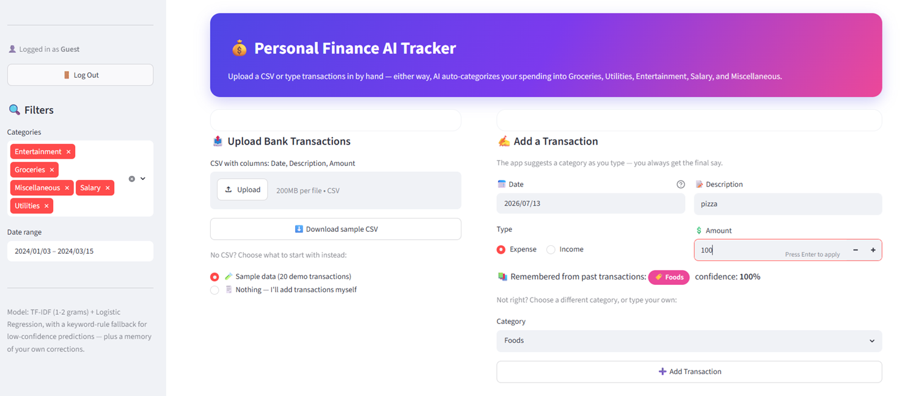
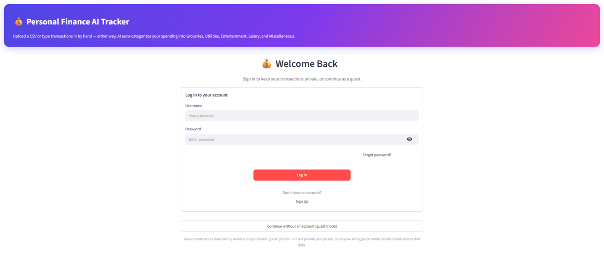
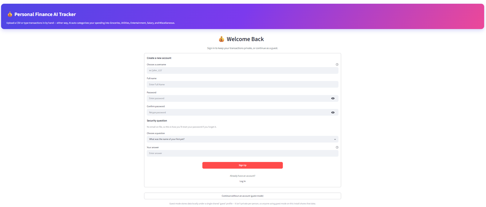
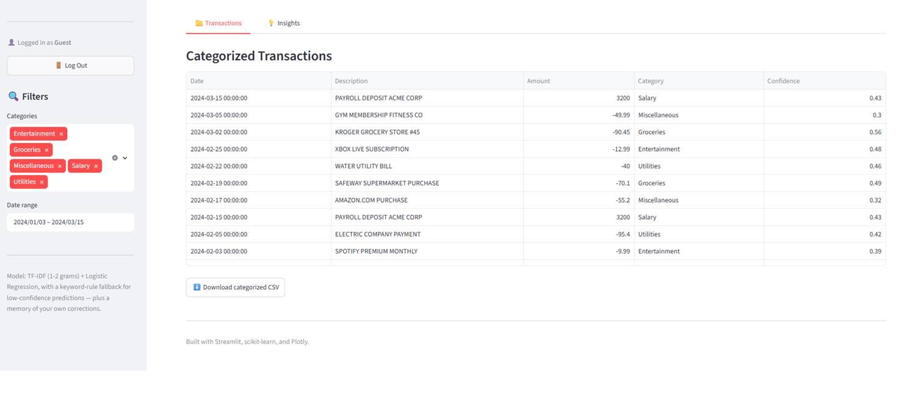
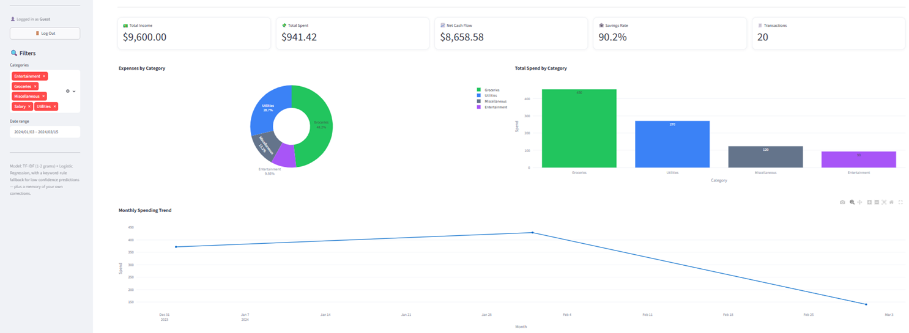
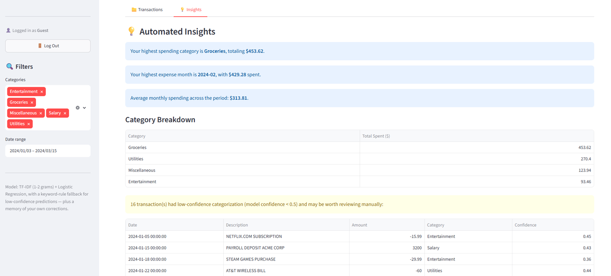

<div align="center">

# 💰 Personal Finance AI Tracker

**A student portfolio project built to explore data engineering and automated categorization. An AI-powered personal finance dashboard that automatically categorizes your spending, learns from your corrections, and supports multiple private user accounts.**

Built with Streamlit, scikit-learn, and SQLite.


</div>

---

## ✨ Features

- 🤖 **AI-Powered Categorization** — a TF-IDF + Logistic Regression model classifies transactions into Groceries, Utilities, Entertainment, Salary, and Miscellaneous, with a keyword-based fallback so every transaction gets a sensible label.
- 🧠 **Learns From You** — correct a category once and the app remembers that exact description forever, including custom categories you create on the fly (e.g. "Foods", "Travel").
- 🔐 **Multi-User Accounts** — signup/login with PBKDF2-hashed passwords (never stored in plain text), a live password-strength meter, and a security-question-based password recovery flow (no email service required).
- 🔁 **Stays Logged In** — a persistent session token survives page refreshes, so you're not bounced back to the login screen every time you reload.
- 👤 **Guest Mode** — try the full app with zero signup; guest data is intentionally never written to disk (and never gets a persistent session either), so it can't leak between different guests.
- 📤 **Flexible Data Entry** — upload a bank CSV, use the built-in 20-transaction demo dataset, or add transactions by hand with live AI category suggestions as you type.
- 📊 **Interactive Dashboard** — KPI cards (income, spend, net cash flow, savings rate), Plotly charts (category breakdown, monthly trend), and a filterable transaction table.
- 🛡️ **Data-Quality Guardrails** — future-dated transactions are detected and flagged automatically, since real bank data should never be dated ahead of today.
- ⚡ **Performance-Conscious UI** — auth forms use Streamlit fragments so live features (like the password meter) don't re-run the entire page on every keystroke.
- 🐳 **Docker-Ready** — one-command deployment with a persistent named volume for the database.

## 🖼️ Screenshots

| Dashboard | Login page | Signup page |
|---|---|---|
|  |  |  |

| Transactions | Visualization | Insights |
|---|---|---|
|  |  |  |

## 🧱 Tech Stack

| Layer            | Technology                                    |
|-------------------|------------------------------------------------|
| App framework     | [Streamlit](https://streamlit.io)              |
| Machine learning  | scikit-learn (TF-IDF + Logistic Regression)    |
| Data handling     | pandas, NumPy                                  |
| Visualization     | Plotly                                         |
| Database          | SQLite (Python standard library `sqlite3`)     |
| Authentication    | PBKDF2-HMAC-SHA256 (standard library `hashlib`)|
| Containerization  | Docker, Docker Compose                         |

## 📂 Project Structure

```
finance_tracker/
├── app.py                     # Main entry point / dashboard layout
├── requirements.txt
├── Dockerfile
├── docker-compose.yml
├── .dockerignore
├── .gitignore
├── LICENSE
├── data/                       # Created automatically at runtime
│   └── users.db                 # Single SQLite file: accounts, sessions, transactions, category memory
└── core/
    ├── __init__.py
    ├── db.py                     # Shared SQLite connection used by every table below
    ├── ml_engine.py              # TF-IDF + Logistic Regression categorizer
    ├── data_loader.py            # CSV loading, mock data, KPI calculations
    ├── transaction_form.py       # Manual transaction entry (editable category)
    ├── category_memory.py        # Learns your corrections + custom categories
    ├── persistence.py            # Manual transactions, stored in users.db
    ├── auth.py                   # User accounts, password hashing, recovery
    ├── auth_ui.py                 # Login / signup / logout Streamlit UI
    ├── session_manager.py         # Keeps you logged in across page refreshes
    └── password_strength.py       # Live password strength meter
```

## 🚀 Getting Started

### Option 1 — Run locally

```bash
git clone https://github.com/rashmitha-g12/finance-tracker.git
cd <repo-name>
pip install -r requirements.txt
streamlit run app.py
```

Open **http://localhost:8501**.

### Option 2 — Run with Docker

```bash
docker compose up --build
```

Open **http://localhost:8501**. Data persists in a named Docker volume across
restarts: `docker compose down` keeps it, `docker compose down -v` wipes it.
Prefer plain Docker over Compose?

```bash
docker build -t finance-tracker .
docker run -p 8501:8501 -v finance_data:/app/data finance-tracker
```

## 🕹️ Usage

1. **Sign up** (username, full name, password, and a security question for recovery) or click **"Continue without an account"** to try guest mode.
2. **Bring in your data** — upload a CSV (`Date, Description, Amount` columns), load the built-in sample dataset, or start empty and add transactions by hand.
3. **Review AI suggestions** — each transaction is auto-categorized; correct any you disagree with and the app remembers that exact description going forward.
4. **Explore the dashboard** — KPI cards, category/monthly charts, and a filterable transaction table, all scoped privately to your account.
5. **Refresh freely** — for real accounts, reloading the page keeps you logged in. (Guest mode intentionally logs you out on refresh, since guest data isn't saved either.)

## About the "Deploy" button

Streamlit adds a **Deploy** button to the toolbar automatically whenever an
app runs on `localhost`. Clicking it only opens a wizard for publishing
*this app's code* to Streamlit Community Cloud (or shows deployment
instructions) — it does not install, copy, or run anything on any other
person's computer, and it does nothing at all unless you actively follow
through the publish flow. If you'd rather not see it (e.g. for a clean
recruiter-facing local demo), add a `.streamlit/config.toml` file:

```toml
[client]
toolbarMode = "viewer"
```

This hides the Deploy button (and the rerun/clear-cache developer options)
while still showing regular Streamlit is being used to end users.

## A note on `data/`

The `data/` folder is created automatically the first time someone signs
up, adds a transaction, or teaches the app a custom category — and it
contains exactly one file: `users.db`. It's local to your machine and
nothing is sent anywhere. Each account's data (transactions, category
corrections) is scoped to its own rows in that database by username, so
multiple people using the same deployed app don't see each other's
transactions or categories.

Guest mode is the one exception: transactions and corrections made while
"Continue without an account" is active are **never written to `users.db`
at all** — they exist only in that browser session's memory and vanish
when it ends. This is deliberate: "guest" is a single identity shared by
anyone who skips signup, so persisting it would mean every guest's data
mixes together. Signing up is what gets you a private, durable account.

## Future-dated transactions

Real bank statements only ever contain settled, historical transactions —
a future date almost always means a typo, a bad CSV export, or a
scheduled/pending payment that hasn't happened yet. The manual entry form
won't let you pick a date past today. Uploaded CSVs can't be blocked the
same way (it's someone else's file), so instead any future-dated rows are
flagged, shown in a dismissible warning for review, and excluded from
totals/charts by default — with a sidebar toggle to include them if you
decide they're legitimate.

## 🏗️ Architecture

<details>
<summary><strong>Click to expand a module-by-module breakdown</strong></summary>

<br>

- **`core/db.py`** — the single shared SQLite connection (`data/users.db`). `auth.py`, `persistence.py`, `category_memory.py`, and `session_manager.py` each own their tables but connect through this one function, so everything stays in one file.
- **`core/ml_engine.py`** — trains a scikit-learn `Pipeline` (`TfidfVectorizer` + `LogisticRegression`) on a curated set of bank-description and everyday-item patterns, cached across reruns with `st.cache_resource`. Exposes `classify_transaction()` (single description → `(category, confidence)`) and `categorize_dataframe()` (bulk). Checks a learned-overrides dict first, then the model, then falls back to keyword rules. `style_for_category()` gives every category — built-in or custom — a stable color/emoji.
- **`core/data_loader.py`** — pure data-layer functions: CSV validation/loading, the 20-row mock dataset, cleaning/coercion, future-date flagging, and KPI aggregation (`calculate_metrics`, `category_totals`, `monthly_totals`).
- **`core/category_memory.py`** — remembers exact description → category corrections and custom category names in two tables (`category_overrides`, `custom_categories`), keyed by username. No-ops for guests.
- **`core/persistence.py`** — stores each account's manually entered transactions in the `manual_transactions` table, keyed by username. No-ops for guests.
- **`core/transaction_form.py`** — the manual-entry form: live category suggestions as you type, an editable dropdown with a custom-category option, per-row delete, and remembers whatever you confirm.
- **`core/auth.py`** — user accounts in the `users` table. Passwords are hashed with PBKDF2-HMAC-SHA256 and a unique per-user salt. Also handles security-question-based password recovery (`get_security_question()`, `verify_security_answer()`, `reset_password()`) since there's no email service integrated.
- **`core/password_strength.py`** — a dependency-free heuristic scorer (0–4) driving the live strength meter on signup and password reset.
- **`core/auth_ui.py`** — Login, Sign Up, and Forgot Password, switched between via buttons rather than tabs (tabs can't be switched programmatically), which is what lets the app auto-redirect to the login form right after signup instead of requiring a manual click. Each form is wrapped in `@st.fragment` so typing in it only reruns that form, not the whole page.
- **`core/session_manager.py`** — persists login across a page refresh via a random token stored in both a `sessions` table and the URL query string (`?session=...`). `st.session_state` is tied to the current browser connection and is wiped on every reload; this is what lets the app recognize a returning, already-logged-in user instead of treating every refresh as a new visitor. Guest logins deliberately skip this.
- **`app.py`** — composes everything into the dashboard. The auth gate runs first; only lightweight, stdlib-only modules are imported before it, and heavier imports (pandas, scikit-learn, Plotly, the ML engine) are deferred until after login so the login screen itself loads fast.

</details>

## 🔒 Security Notes

- Passwords and security-question answers are hashed with **PBKDF2-HMAC-SHA256** and a unique random salt per user — never stored in plain text.
- Each account's data lives in its own database rows, isolated by username — one deployed instance can safely serve multiple people.
- **Login sessions persist via a URL token**, not a cookie (Streamlit has no built-in cookie support without an extra component). Tokens are 32 random bytes (~43 characters), expire after 30 days, and are invalidated immediately on logout. This is a reasonable trade-off for a personal/demo project, but note that a URL-based token can leak through browser history in a way an `HttpOnly` cookie wouldn't — worth swapping for real cookie-based sessions before handling sensitive data at scale.
- **Guest mode is never persisted.** Since "guest" is a single identity shared by anyone who skips signup, writing guest data (or a guest login session) to disk would mean different guests' transactions mix together. Guest data lives only in that browser session's memory and disappears on refresh or tab close.
- `data/` (containing `users.db`, i.e. every account's real data, password hashes, and active session tokens) is excluded via `.gitignore` and `.dockerignore` — **never remove it from either** if you test this with real data.

## ⚠️ Known Limitations / Roadmap

This project was built to demonstrate the architecture and ML approach cleanly, not as a production banking tool. Documented gaps, in order of what I'd tackle first:

- [ ] **Bank-grade password hashing** — swap PBKDF2 for `bcrypt`/`argon2-cffi` for production use.
- [ ] **Cookie-based sessions** — replace the URL-token approach in `session_manager.py` with an `HttpOnly` cookie for better security against history/log leakage.
- [ ] **Real bank CSV formats** — actual exports have noisy descriptions, truncated merchant codes, and sometimes a different sign convention; the classifier's training data would need extending per-bank.
- [ ] **Multi-currency support** — everything currently assumes a single `$`-denominated currency.
- [ ] **Transfer/refund detection** — moving money between your own accounts currently just looks like ordinary income/spend.
- [ ] **Login rate limiting** — no brute-force protection on the login form yet.
- [ ] **A real database for scale** — SQLite isn't built for many concurrent writers; a multi-tenant deployment would want Postgres behind this.
- [ ] **Larger training set** — the classifier learns from curated synthetic examples, not a large real-world labeled dataset; the category-memory/override system compensates for this over time, but a bigger corpus would improve out-of-the-box accuracy.

## 📜 License

Distributed under the MIT License. See [`LICENSE`](LICENSE) for details.

## 🙋 About This Project

Built as a portfolio project to demonstrate:

- End-to-end **Streamlit application design** — modular architecture, custom UI components, and performance-aware use of fragments.
- **Applied machine learning** for text classification (TF-IDF + Logistic Regression) with a practical fallback strategy for low-confidence predictions.
- **SQLite schema design** for a multi-user application, including per-user data isolation and token-based session persistence.
- **Authentication fundamentals** — salted password hashing, strength validation, and a creative no-email account-recovery flow.
- **Containerization** with Docker and Docker Compose, including persistent volumes and health checks.